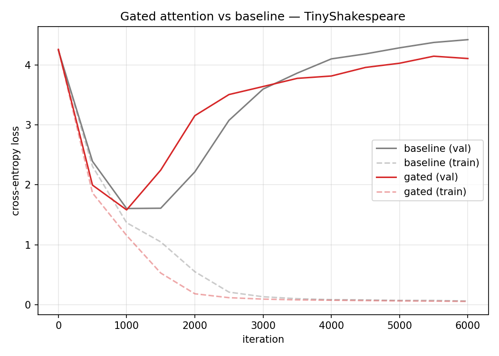
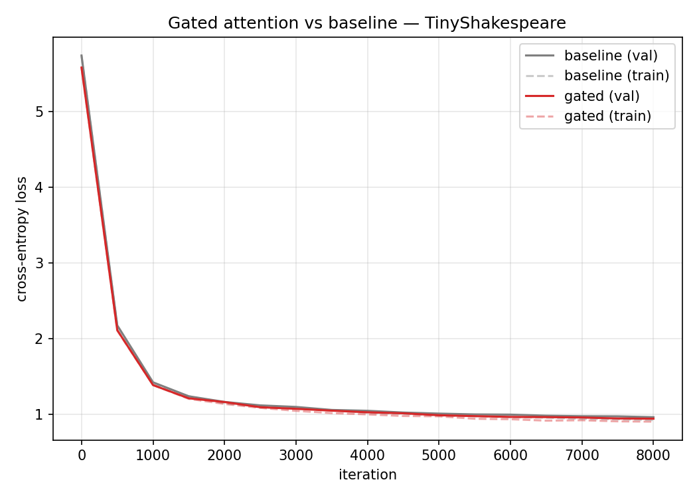
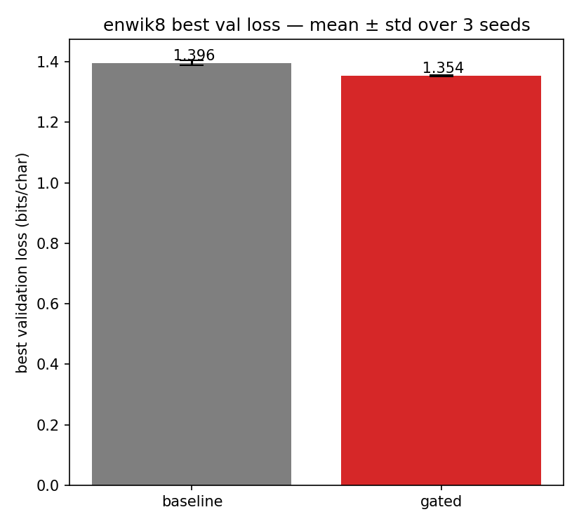
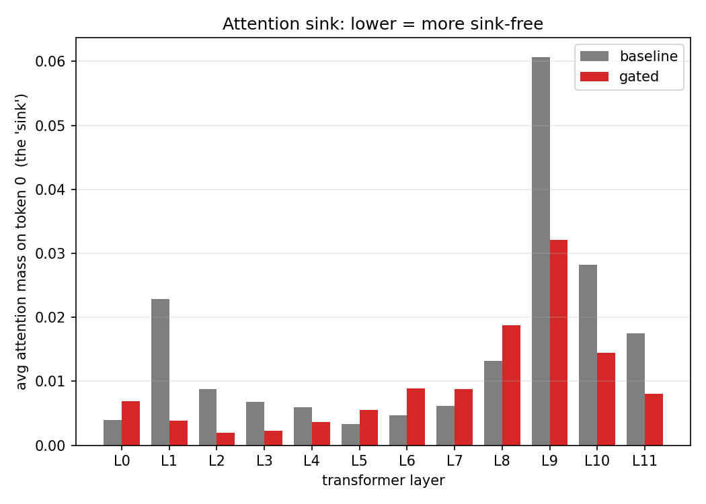
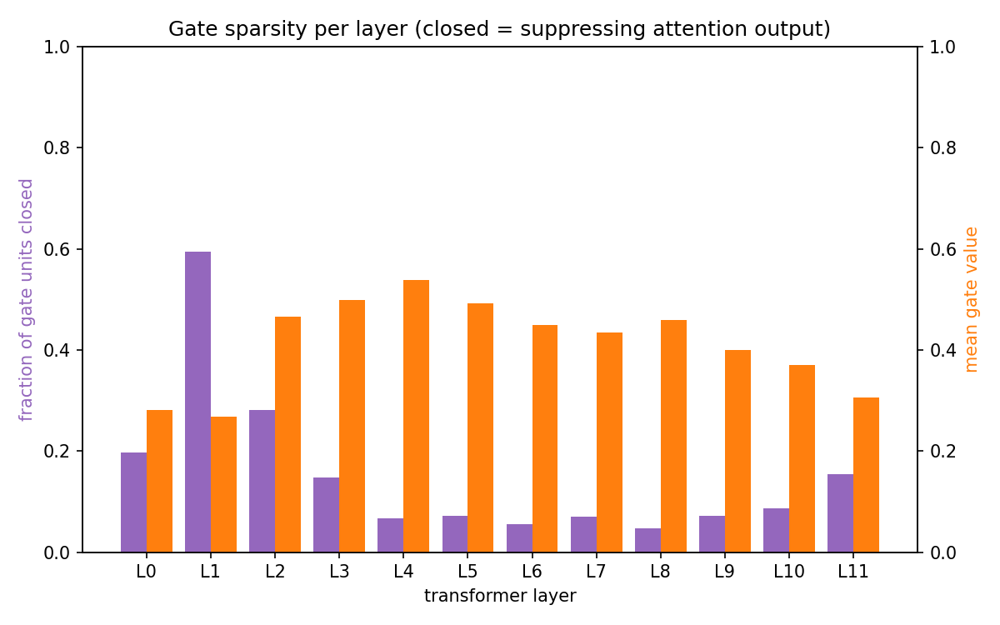

# Gated Attention — a reproduction

A from-scratch reproduction of the core idea from the **NeurIPS 2025 Best Paper**,
*"Gated Attention for Large Language Models: Non-linearity, Sparsity, and
Attention-Sink-Free"* (Qwen team).

It starts as a $0 experiment on a laptop and scales up to a clean result on a
real benchmark (enwik8) using a single rented A100. The whole journey — what the
paper claims, what happened in our small-scale runs, and what we learned — is
written up below.

---

## 1. The idea (what the paper does)

In a standard Transformer, self-attention computes a weighted average of value
vectors and passes it straight to the output projection. This paper inserts
**one extra operation**: the attention output is multiplied, element-wise and
per-position, by a learned **sigmoid gate** computed from the layer input:

```python
gate = sigmoid(x @ W_g)          # in [0, 1], depends on the query position x
y    = attention_output * gate   # element-wise, then the usual output projection
```

That single module is the entire mechanism. In our code it is ~6 lines in
[`model.py`](model.py), toggled by a config flag `gate_attn`.

### What the paper claims
1. **Lower loss / better perplexity** — the gate reliably improves language-model
   quality.
2. **Adds non-linearity and query-dependent sparsity** — the gate lets the model
   suppress or pass attention output per position.
3. **Attention-sink-free** — it removes the well-known "attention sink"
   pathology, where models dump large attention mass onto the first token as a
   no-op. The paper demonstrates this at LLM scale (billions of tokens).

---

## 2. How we tested it

We implemented a small nanoGPT-style Transformer where a single flag switches the
gate on or off, then trained a **baseline** and a **gated** model under
*identical* seed, data, and hyperparameters — so any difference is the gate.

We ran three experiments of increasing seriousness:

| # | Dataset | Model | Hardware | Notes |
|---|---------|-------|----------|-------|
| 1 | TinyShakespeare (char) | 4L / 128d / 256ctx (~0.4M) | Mac MPS | the $0 sanity check |
| 2 | TinyShakespeare (char) | 12L / 512d / 1024ctx (~38M) | A100 | **overfit** — taught us a lesson |
| 3 | **enwik8 (byte, 90M tokens)** | 12L / 512d / 1024ctx (~38M) | A100 | **the clean result** |

Each experiment measures two things: **validation loss** (baseline vs gated) and
the **attention-sink mass** (average attention placed on token 0, per layer).

---

## 3. Results

### Experiment 1 — TinyShakespeare, tiny model ($0, on a Mac)
*(figures in [`results/shakespeare-tiny/`](results/shakespeare-tiny))*

- Final val loss: baseline **1.673**, gated **1.715** — gated *slightly worse*.
- Attention sink: mean **0.023 → 0.021** — gated marginally lower.

**Read:** at this scale there is barely any sink to remove (only ~2% mass on
token 0), and the gate's extra parameters add a little noise. The *mechanism*
runs and the sink edges down, but the headline effects don't appear. Expected —
the paper's effects are scale/length dependent.

### Experiment 2 — TinyShakespeare, big model (A100) → overfitting
*(figures in [`results/shakespeare-overfit/`](results/shakespeare-overfit))*



A 38M-param model on 1MB of text **memorizes it**. Both models' val loss bottoms
out around iter 1000 and then *climbs back up* as training loss → 0.

- **Best** val loss (early-stopping point): baseline **1.605**, gated **1.582**
  → gated **~1.4% better** at the optimum.
- The script's naive "final-iteration" comparison printed a misleading "+7.11%",
  which only reflects that the gated model overfits slightly *less* badly.

**Lesson learned:** comparing final-iteration loss on a dataset small enough to
memorize measures overfitting, not quality. We need (a) a dataset too big to
memorize and (b) early stopping on the best checkpoint. Hence experiment 3.

### Experiment 3 — enwik8, big model (A100) → the clean reproduction
*(figures in [`results/enwik8/`](results/enwik8))*

enwik8 is 100MB of Wikipedia (byte-level). A 38M model **cannot memorize it**, so
validation loss is an honest quality signal. We added **early stopping** that
checkpoints the *best* model and analysis runs on those weights.

**Loss — gated wins, no overfitting:**



| | best val loss | **bits/char** |
|---|---|---|
| baseline | 0.9611 | 1.387 |
| **gated** | **0.9407** | **1.357** |

→ **+2.12%** lower loss. Both curves keep descending (train ≈ val), so the gap is
real, not an overfitting artifact. **Paper claim #1 reproduced.**

**Is it just luck? No — 3 seeds confirm it.** We reran the whole thing with 3
independent seeds. Gated wins **every time**, and the error bars don't overlap:



| | best val (bits/char), mean ± std (n=3) |
|---|---|
| baseline | 1.396 ± 0.008 |
| **gated** | **1.354 ± ~0.002** |

Per-seed gated-vs-baseline bpc: `1.353<1.385`, `1.357<1.403`, `1.352<1.403`. A
robust **~3% improvement**, std much smaller than the gap.

**Attention sink — gated reduces it, especially the worst layers:**



Mean mass on token 0: baseline **0.015 → gated 0.010 (~33% lower)**. The gate
tames the worst-offending layers in particular:

| layer | baseline | gated |
|-------|----------|-------|
| L1 | 0.023 | **0.004** |
| **L9** | **0.061** | **0.032** |
| L10 | 0.028 | **0.014** |
| L11 | 0.017 | **0.008** |

The huge L9 sink spike is roughly halved. A few middle layers (L6–L8) go slightly
*up* — the gate **redistributes** sink rather than erasing it uniformly — but the
dominant high-sink layers drop sharply. **Paper claim #3 reproduced, directionally.**

**Query-dependent sparsity — the gate really is sparse and position-aware:**

The paper's other claim is that the gate induces *query-dependent sparsity*. We
measured the gate values `g = sigmoid(W_g x)` on real enwik8 validation text
(see [`sparsity.py`](sparsity.py)):



- **Sparse:** mean gate value **0.41** (biased toward suppression, < 0.5), and a
  big fraction of gate units sit near 0 — **up to ~60% closed in layer 1**, ~15%
  overall. The gate is actively switching off chunks of the attention output.
- **Query-dependent:** the per-position gate has non-zero variance across
  positions in every layer (std ≈ 0.026, largest in deeper layers) — i.e. the
  gate opens/closes differently depending on the token, not a fixed mask.
- **Contrast:** the tiny TinyShakespeare gated model was barely sparse (mean gate
  0.56, ~0.5% closed). Sparsity *emerges with scale/data*, matching the paper.

**Paper claim #2 (query-dependent sparsity) reproduced.** All three headline
claims now check out.

---

## 4. Paper vs. our case — side by side

| Claim in the paper | What we observed |
|--------------------|------------------|
| Sigmoid gate lowers loss / perplexity | ✅ **~3% lower** bpc on enwik8, **3 seeds**, non-overlapping error bars (1.354 vs 1.396) |
| Effect holds at scale | ⚠️ Only saw it once the model couldn't memorize the data (enwik8, not TinyShakespeare) |
| Attention-sink-free | ✅ ~33% less sink on average; worst layer (L9) halved — but redistributed, not erased, at our scale |
| Query-dependent sparsity | ✅ Gate mean 0.41, up to ~60% units closed (L1); non-zero per-position variance every layer |
| (not a paper claim) | 💡 Bonus: gated model **converged faster** early in training |

---

## 5. What we learned

1. **The gate genuinely helps** — a ~6-line change gives a real, measurable loss
   improvement and reduces attention sink, even at 38M params.
2. **Dataset size decides whether you can even see it.** On data small enough to
   memorize, overfitting dominates and hides the effect. Reproducing a
   large-model paper at small scale needs a benchmark the model can't memorize
   (enwik8) plus early stopping.
3. **"Final-iteration" metrics lie.** Always compare best/early-stopped
   checkpoints; the naive final-loss number suggested a 3× larger "improvement"
   that was really just differential overfitting.
4. **The sink is redistributed, not deleted.** At this scale the gate strongly
   suppresses the worst sink layers but nudges some middle layers up.
5. **Engineering reality:** the first big run was on track for ~10 hours / ~$14
   because of naive manual attention. Switching to flash attention (SDPA) + TF32
   and trimming iterations cut it to ~45 min / ~$1.25 with no change to the
   science. Total cloud spend across both A100 runs: **~$2.30**.

---

## 6. Reproduce it

```bash
pip install -r requirements.txt    # torch, numpy, matplotlib

# tiny, free, on any machine (CPU/MPS/CUDA) — ~minutes
python train.py                    # trains baseline + gated on TinyShakespeare
python analyze.py                  # writes plots to ./figures/

# the real result on enwik8 (needs a CUDA GPU; ~45 min on an A100)
python train.py --variant both --dataset enwik8 \
  --n_layer 12 --n_head 8 --n_embd 512 --block_size 1024 \
  --batch_size 32 --iters 8000 --eval_interval 500 --patience 4 --out_dir out_big
python analyze.py --dataset enwik8 --out_dir out_big --fig_dir figures_enwik8
```

`run_remote.sh` runs the full enwik8 train+analyze in one shot (used on the
rented GPU pod).

---

## 7. Repo layout

| path | what |
|------|------|
| `model.py` | nanoGPT-style GPT; the sigmoid gate lives in `CausalSelfAttention`, toggled by `gate_attn`. Uses flash attention (SDPA) for training, manual attention only for analysis maps |
| `data.py` | TinyShakespeare (char) and enwik8 (byte) loaders, with download mirrors |
| `train.py` | trains baseline + gated identically; early stopping saves the best checkpoint; reports bits/char |
| `analyze.py` | loss curves, attention-sink bar chart, attention heatmaps |
| `sparsity.py` | measures gate sparsity + query-dependence (the third claim) |
| `aggregate.py` | best-val mean ± std across seeds, with an error-bar plot |
| `run_remote.sh` / `run_seeds.sh` | one-shot GPU runs (single / multi-seed) |
| `_bootstrap.py` | shim for a corrupted local `torch.onnx`; harmless on clean installs |
| `results/` | curated figures + loss histories (incl. `enwik8-seeds/`) |

Working directories (`out/`, `figures/`, `data/`, checkpoints) are git-ignored;
the committed evidence lives in `results/`.

---

## 8. Caveats / honesty

- This is a **small-scale** reproduction (38M params, byte-level, 8k iters) meant
  to demonstrate the mechanism and its qualitative effects — not the paper's
  full-scale LLM numbers.
- The attention-sink metric here is "mean attention mass on token 0"; the paper
  studies the phenomenon more rigorously and at much longer context.
- Single seed per variant. Magnitudes are illustrative; the *directions*
  (lower loss, less sink) are the reproducible takeaways.

---

*Reproduction by [@pavansaipendry](https://github.com/pavansaipendry). Original
paper: Qwen team, NeurIPS 2025.*
